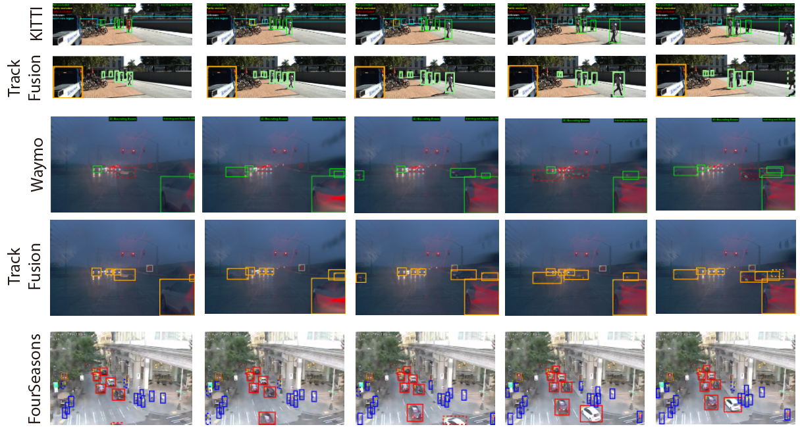

# TrackFusion: Obtaining Multi-Object Tracking Annotations at Scale

 

TrackFusion is a tracking annotation fusion algorithm that produces high-quality tracks using partially correct results received from multiple annotators, while carefully weeding out poor quality results and  under-performing annotators. TrackFusion is implemented on an open-source image annotation platform and exhibits over 98% precision and recall of tracks in the KITTI and Waymo data sets. We have used it to produce one of the largest available multi-object tracking data sets, FourSeasons, which has over 195,000 annotated frames spanning over a year. 

## Dataset: FourSeasons [Download](https://trafficcamdataset.wordpress.com/)

FourSeasons is the first dataset that has continuously sampled video segments that span over a year. We use TrackFusion to collect and publish this dataset to help estabilsh benchmarks to examine and verify model sensitivity and robustness to season, weather, and climate impacts.

